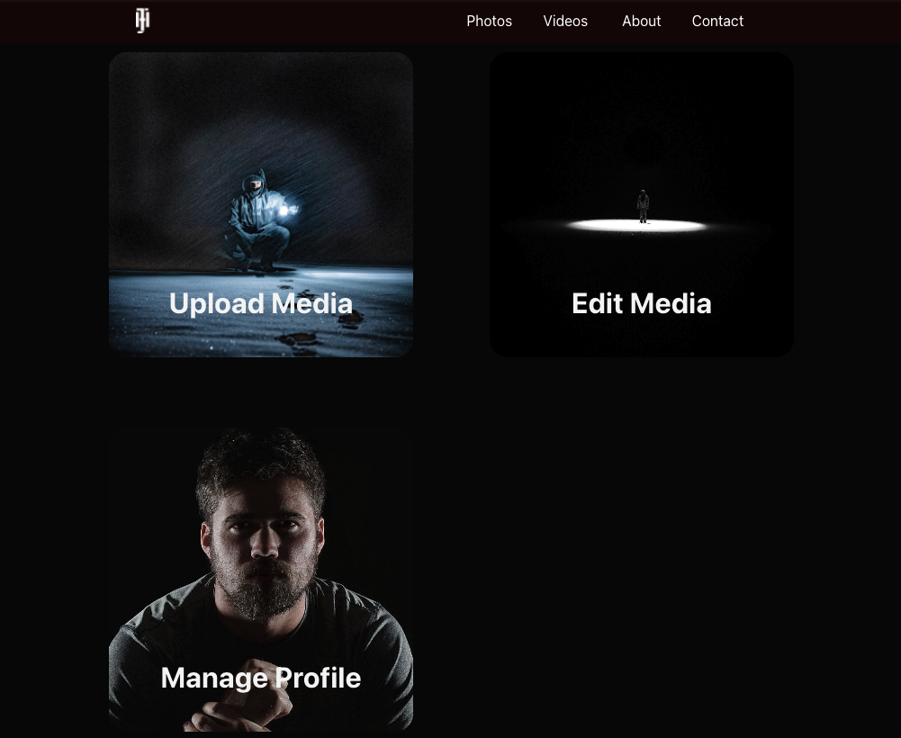
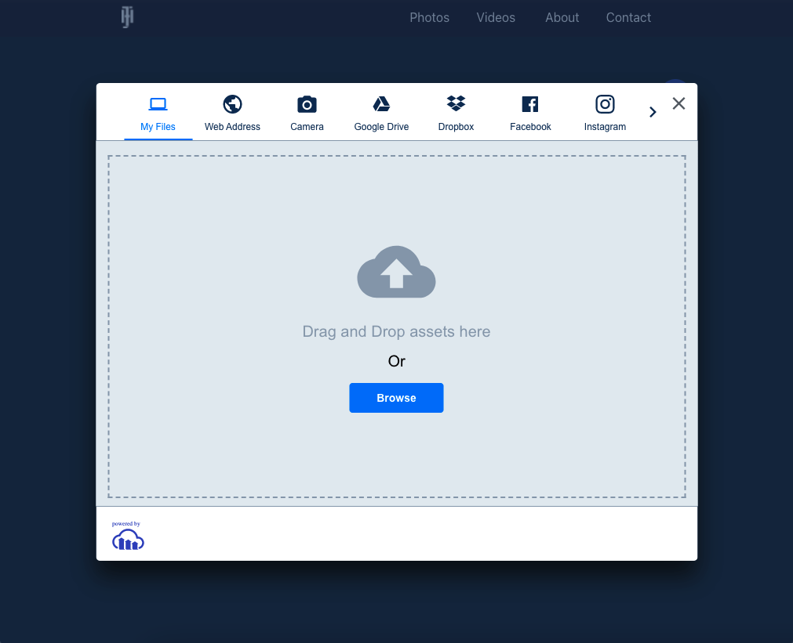
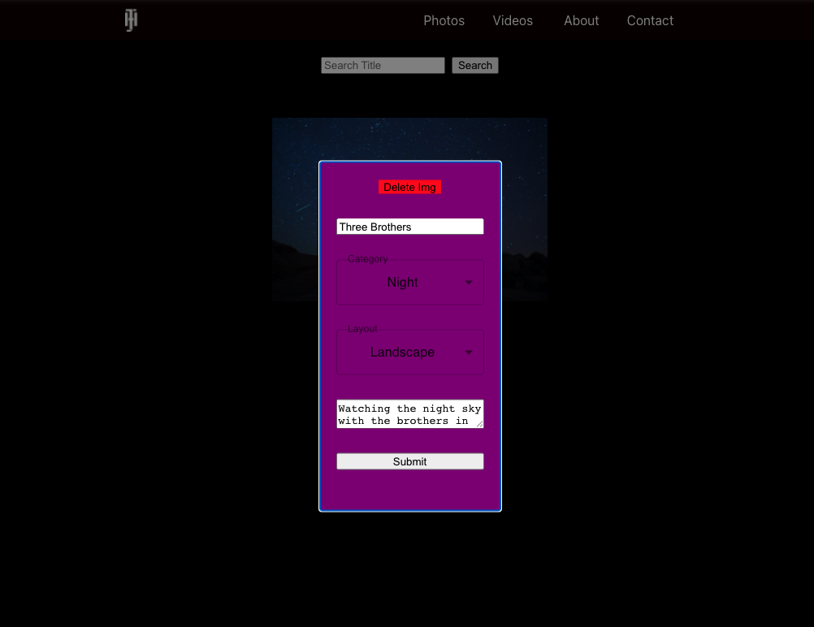
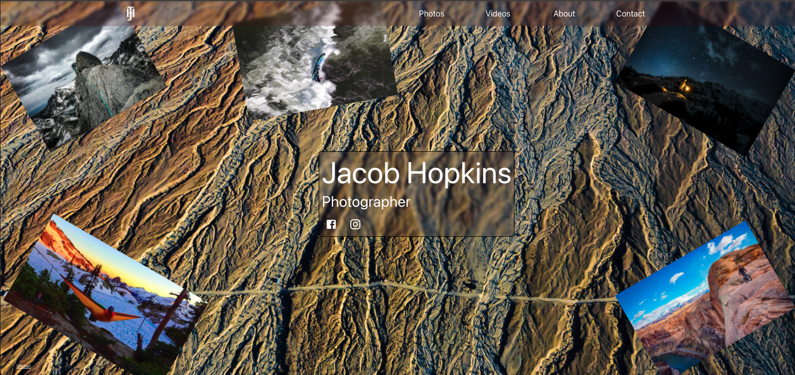
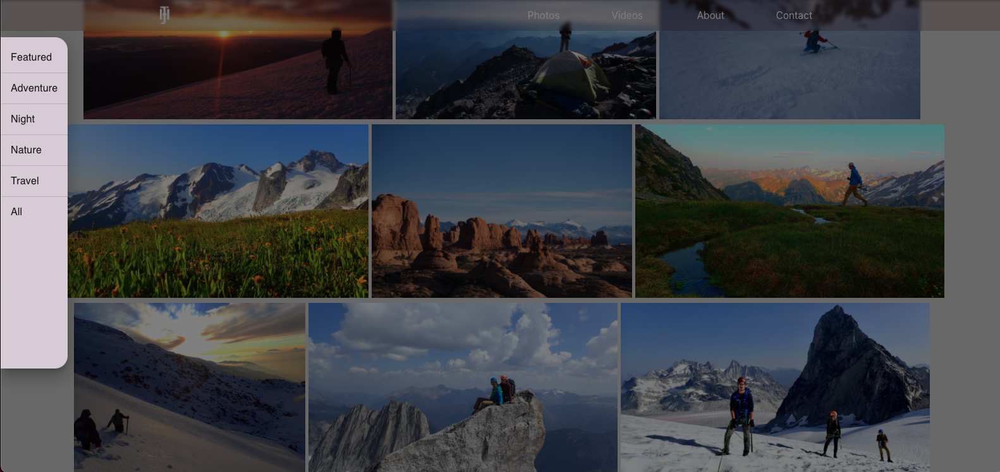
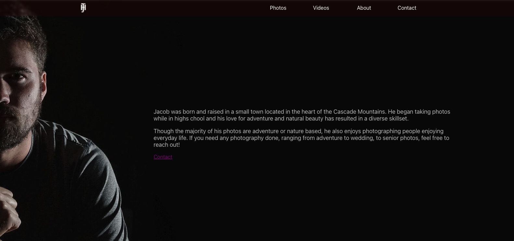

  # Jacob's Portfolio

  <a href="https://jacobsportfolio1234.herokuapp.com/">Deployed</a>

  ## Description

  A websight built for a photographer. This site allows the photographer to upload images, add text, or edit the text of the image. The first three images are of the photographer operated side while the other three are the public faceing side. 

  ## Images

  Private

  

  

  

  Public

  

  

  

  
  ## Table of Content

  * [Installation](#installation)

  * [Usage](#usage)

  * [License](#license)

  * [Contributing](#contributors)

  * [Contact](#questions/contact)

  ## Installation

  To Install necessary dependencies, run the following command:
  
  NA

  ## Usage

      Just a normal website.
  
  ## Technologies

  React, Javascript, and MongoDB. NPM packages include bcrypt, cloudinary, cors, dotenv, express, jsonwebtoken, mongoose, nodemailer, and validator. 

  ## Contributors

  Ben Hopkins and Sam Oberg

  ## Questions/Contact

  <a href="https://github.com/bh007183">Ben's GitHub Profile</a>
  <a href="https://github.com/sosoberg">Sams's GitHub Profile</a>
  <a href="mailto:bjhops17@gmail.com"> Email Us</a>
  
  

  